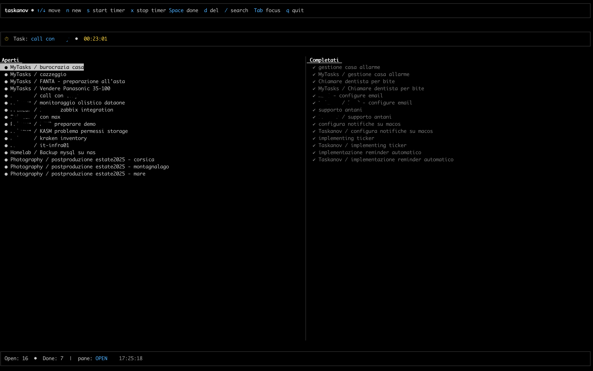

# Taskanov

**Taskanov** is a cross-platform task manager designed to be **simple**, **extensible**, and **integrable** with external tools.  
It provides a **TUI (text user interface)** powered by `prompt_toolkit`, supports multiple **storage backends**, integrates a **timer system with notifications**, and can sync with external services like **Google Calendar** and **Nextcloud Tasks**.  



---


## ✨ Features

- **JSON Backend** (default)  
  - Stores tasks locally in a JSON file.  
  - Full CRUD support (create, read, update, close tasks).  
  - Search and filtering of tasks.  

- **Google Calendar Backend** *(optional)*  
  - Create events directly in Google Calendar.  
  - Synchronize with existing tasks.  
  - Async handling using `asyncio`.  

- **Integrated Timer**  
  - Start a timer for a selected task.  
  - View active tasks with running timers.  
  - Optionally generate a calendar event at the end of a timer (e.g. in Google Calendar or Nextcloud).  

- **Cross-platform Notifications**  
  - **macOS**: integration with `terminal-notifier` (support for “Show” button to bring TUI to the foreground).  
  - Future support planned for Linux (`notify-send`) and Windows (`toast`).  

- **TUI (Text User Interface)**  
  - Task list with status (open, closed, active).  
  - Keyboard shortcuts for creating, updating, closing tasks.  
  - Smooth navigation using `prompt_toolkit`.  
  - Validated inputs (e.g. radio lists instead of free text).  

- **Nextcloud Integration (planned)**  
  - Read tasks via DAV APIs (Deck/Tasks).  
  - Automatically create calendar events in Nextcloud when a timer finishes.  

- **Modular Configuration**  
  - Switch backend through config file.  
  - YAML/JSON configuration for preferences (notifications, default timer length, active backend).  

---

## 🚀 Installation

Clone the repository and create a virtual environment:

```bash
git clone https://github.com/matteogaito/taskanov.git
cd taskanov
python3 -m venv .venv
source .venv/bin/activate
pip install -e .

On macOS, install terminal-notifier for notifications:
```bash
brew install terminal-notifier

## 📦 Usage

### 🔹 Taskanov TUI
```po
$ taskanov tui
```

### 🔹 Keyboard shortcuts
```po
n   → create a new task
t   → start a timer on selected task
c   → close a task
a   → show active tasks
q   → quit
```

### 🔹 Google backend
If you want to use the Google Calendar backend, you must **create your own Google app** and credentials (OAuth client) in the Google Cloud Console.  
Taskanov does not provide credentials out of the box.  

- The application type must be **Desktop app**.  
- If you keep it in **Testing mode**, you need to validate your user before usage.  
- Download the credentials and place them at:  
  - **macOS/Linux** → `~/.config/taskanov/google/credentials.json`  

Then enable the backend with a config file (stored at `~/.config/taskanov/config.yaml`):  

```yaml
backend:
  type: google
  google:
    statefile: "google_state.json"
    calendar: "taskanov"

## 🔮 Roadmap
- [ ] Autosuspend when workstation is idle
- [ ] Nextcloud backend (Deck/Tasks + Calendar)
- [ ] Linux (`notify-send`) and Windows (`toast`) notification support
- [ ] Export activity reports (JSON, CSV)
- [ ] Integration with more systems (Jira, Trello, etc.)


## 🔍 Keywords
task manager · tasks · tui · cli · productivity · timer · time tracker · notifications · google calendar · nextcloud · python · todo list · time tracking · cross-platform · macos · linux · open-source 